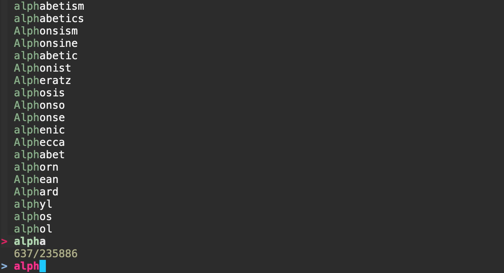

# fzf - A command-line fuzzy finder

<TagLinks />

## TL,DR
[FZF](https://github.com/junegunn/fzf) makes searching and filtering list quick and easy. Try the following command.

``` sh
cat /usr/share/dict/words | fzf
```

Start typing and watch the magic happen.



## Deep Dive

:::note 
The following was pulled from the fzf readme.md
:::

Usage
-----

fzf will launch interactive finder, read the list from STDIN, and write the
selected item to STDOUT.

```sh
find * -type f | fzf > selected
```

Without STDIN pipe, fzf will use find command to fetch the list of
files excluding hidden ones. (You can override the default command with
`FZF_DEFAULT_COMMAND`)

```sh
vim $(fzf)
```

#### Using the finder

- `CTRL-J` / `CTRL-K` (or `CTRL-N` / `CTRL-P`) to move cursor up and down
- `Enter` key to select the item, `CTRL-C` / `CTRL-G` / `ESC` to exit
- On multi-select mode (`-m`), `TAB` and `Shift-TAB` to mark multiple items
- Emacs style key bindings
- Mouse: scroll, click, double-click; shift-click and shift-scroll on
  multi-select mode

#### Layout

fzf by default starts in fullscreen mode, but you can make it start below the
cursor with `--height` option.

```sh
vim $(fzf --height 40%)
```

Also check out `--reverse` and `--layout` options if you prefer
"top-down" layout instead of the default "bottom-up" layout.

```sh
vim $(fzf --height 40% --reverse)
```

You can add these options to `$FZF_DEFAULT_OPTS` so that they're applied by
default. For example,

```sh
export FZF_DEFAULT_OPTS='--height 40% --layout=reverse --border'
```

#### Search syntax

Unless otherwise specified, fzf starts in "extended-search mode" where you can
type in multiple search terms delimited by spaces. e.g. `^music .mp3$ sbtrkt
!fire`

| Token     | Match type                 | Description                          |
| --------- | -------------------------- | ------------------------------------ |
| `sbtrkt`  | fuzzy-match                | Items that match `sbtrkt`            |
| `'wild`   | exact-match (quoted)       | Items that include `wild`            |
| `^music`  | prefix-exact-match         | Items that start with `music`        |
| `.mp3$`   | suffix-exact-match         | Items that end with `.mp3`           |
| `!fire`   | inverse-exact-match        | Items that do not include `fire`     |
| `!^music` | inverse-prefix-exact-match | Items that do not start with `music` |
| `!.mp3$`  | inverse-suffix-exact-match | Items that do not end with `.mp3`    |

If you don't prefer fuzzy matching and do not wish to "quote" every word,
start fzf with `-e` or `--exact` option. Note that when  `--exact` is set,
`'`-prefix "unquotes" the term.

A single bar character term acts as an OR operator. For example, the following
query matches entries that start with `core` and end with either `go`, `rb`,
or `py`.

```
^core go$ | rb$ | py$
```

#### Environment variables

- `FZF_DEFAULT_COMMAND`
    - Default command to use when input is tty
    - e.g. `export FZF_DEFAULT_COMMAND='fd --type f'`
- `FZF_DEFAULT_OPTS`
    - Default options
    - e.g. `export FZF_DEFAULT_OPTS="--layout=reverse --inline-info"`

#### Options

See the man page (`man fzf`) for the full list of options.

#### Demo
If you learn by watching videos, check out this screencast by [@samoshkin](https://github.com/samoshkin) to explore `fzf` features.

<a title="fzf - command-line fuzzy finder" href="https://www.youtube.com/watch?v=qgG5Jhi_Els">
  
</a>

Examples
--------

Many useful examples can be found on [the wiki
page](https://github.com/junegunn/fzf/wiki/examples). Feel free to add your
own as well.

`fzf-tmux` script
-----------------

[fzf-tmux](bin/fzf-tmux) is a bash script that opens fzf in a tmux pane.

```sh
# usage: fzf-tmux [-u|-d [HEIGHT[%]]] [-l|-r [WIDTH[%]]] [--] [FZF OPTIONS]
#        (-[udlr]: up/down/left/right)

# select git branches in horizontal split below (15 lines)
git branch | fzf-tmux -d 15

# select multiple words in vertical split on the left (20% of screen width)
cat /usr/share/dict/words | fzf-tmux -l 20% --multi --reverse
```

It will still work even when you're not on tmux, silently ignoring `-[udlr]`
options, so you can invariably use `fzf-tmux` in your scripts.

Alternatively, you can use `--height HEIGHT[%]` option not to start fzf in
fullscreen mode.

```sh
fzf --height 40%
```

Key bindings for command-line
-----------------------------

The install script will setup the following key bindings for bash, zsh, and
fish.

- `CTRL-T` - Paste the selected files and directories onto the command-line
    - Set `FZF_CTRL_T_COMMAND` to override the default command
    - Set `FZF_CTRL_T_OPTS` to pass additional options
- `CTRL-R` - Paste the selected command from history onto the command-line
    - If you want to see the commands in chronological order, press `CTRL-R`
      again which toggles sorting by relevance
    - Set `FZF_CTRL_R_OPTS` to pass additional options
- `ALT-C` - cd into the selected directory
    - Set `FZF_ALT_C_COMMAND` to override the default command
    - Set `FZF_ALT_C_OPTS` to pass additional options

If you're on a tmux session, you can start fzf in a split pane by setting
`FZF_TMUX` to 1, and change the height of the pane with `FZF_TMUX_HEIGHT`
(e.g. `20`, `50%`).

If you use vi mode on bash, you need to add `set -o vi` *before* `source
~/.fzf.bash` in your .bashrc, so that it correctly sets up key bindings for vi
mode.

More tips can be found on [the wiki page](https://github.com/junegunn/fzf/wiki/Configuring-shell-key-bindings).